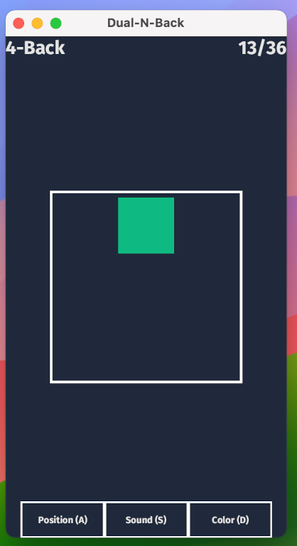

# Dual-N-Back with Bevy

This repository contains an implementation of the Dual-N-Back game using the Bevy game engine. Dual-N-Back is a cognitive task designed to improve working memory and fluid intelligence. It challenges players to remember sequences of visual and auditory stimuli over various intervals.

## Overview

The game requires players to identify when the current stimulus matches the one presented N steps back in the sequence. This implementation provides both visual and auditory stimuli, adjustable difficulty levels, and tracks user performance over time.

## Technical Details

- Engine: Built with [Bevy], a data-driven game engine written in [Rust].
- Functionality: Includes customizable N-back levels, with automatic difficulty adjustments based on user performance. Performance statistics are recorded for review.
- Compatibility: Supports multiple platforms, leveraging Bevy's cross-platform capabilities.

## Getting Started

Start by installing [Rust] and [Bevy]. Then simply run:

```bash
cargo run
```

## Contribution

Contributions are open for bug fixes or feature additions. Please use GitHub's pull request and issues system for contributions.

## Screenshots




[Rust]: https://www.rust-lang.org/
[Bevy]: https://bevyengine.org/
